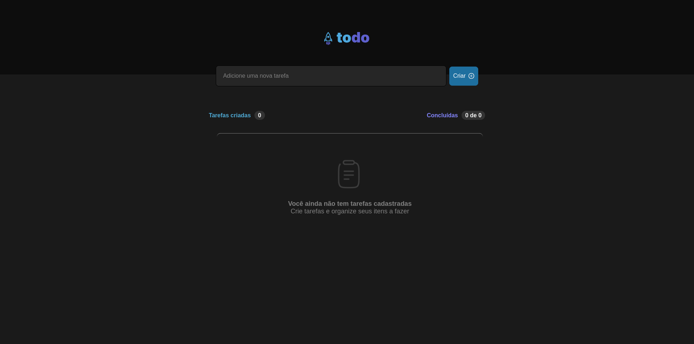
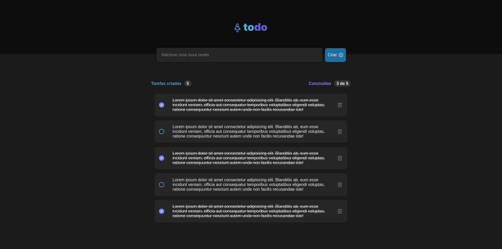

# Sobre esse projeto

## To-do List
Este é um projeto de To-do List desenvolvido como desafio prático para reforçar conceitos fundamentais do ReactJS.

    
    

# Funcionalidades

* Adicionar uma nova tarefa

* Marcar e desmarcar uma tarefa como concluída

* Remover uma tarefa da listagem

* Mostrar o progresso de conclusão das tarefas

 

# Conceitos abordados

* Estados

* Imutabilidade do estado

* Listas e chaves no ReactJS

* Propriedades

* Componentização

 

# Como utilizar

1- Clone o projeto
`git@github.com:helen-andrade/todo-list-reactJs.git`

2- Instale as dependências
`npm i`

3- Rode o script de desenvolvimento
`npm run dev`

---

    
Feito com ♡ por Helen Andrade

